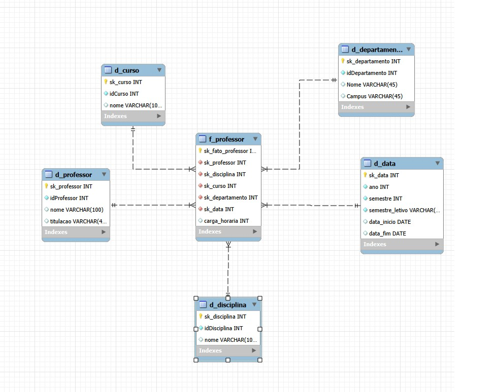

# Star Schema: análise de professores

Projeto do desafio de modelagem dimensional da DIO (Formação Power BI Analyst, módulo de Introdução à Modelagem Dimensional).

A partir do diagrama relacional de uma universidade (Professor, Departamento, Curso, Disciplina, Aluno, Matriculado e Pré-requisitos), montei um esquema em estrela com foco em **professor** como objeto de análise.

## O desenho



Diagrama EER feito no MySQL Workbench. O arquivo editável, pra abrir direto no Workbench, é o `diagrama_star_schema.mwb`.

## Granularidade

Uma linha da fato representa **um professor ministrando uma disciplina em um curso, em um semestre letivo**.

Escolhi esse nível porque uma disciplina pode pertencer a mais de um curso (é a tabela `Disciplina & Curso` do modelo relacional). Se eu parasse em professor × disciplina, o segundo curso se perderia. Com o curso na granularidade, perguntas como "em quantos cursos esse professor atua?" viram uma simples contagem de linhas.

## Tabelas

A fato `f_professor` guarda só as chaves que apontam para as dimensões e a métrica. Os detalhes ficam nas dimensões.

| Tabela | Papel | Colunas |
|---|---|---|
| `f_professor` | Fato | `sk_fato_professor` (PK), `sk_professor`, `sk_disciplina`, `sk_curso`, `sk_departamento`, `sk_data` (FKs), `carga_horaria` (métrica) |
| `d_professor` | Dimensão | `sk_professor` (PK), `idProfessor`, `nome`, `titulacao` |
| `d_disciplina` | Dimensão | `sk_disciplina` (PK), `idDisciplina`, `nome` |
| `d_curso` | Dimensão | `sk_curso` (PK), `idCurso`, `nome` |
| `d_departamento` | Dimensão | `sk_departamento` (PK), `idDepartamento`, `Nome`, `Campus` |
| `d_data` | Dimensão | `sk_data` (PK), `ano`, `semestre`, `semestre_letivo`, `data_inicio`, `data_fim` |

Todas as ligações são de um para muitos: uma linha de cada dimensão aparece em várias linhas da fato.

## Decisões de modelagem

**Chaves artificiais.** Toda tabela tem uma chave `sk_` numérica e sequencial como PK. O id original do modelo relacional (`idProfessor`, `idCurso`...) fica como coluna comum na dimensão.

**Departamento como dimensão própria.** No modelo relacional, o departamento se liga ao professor e ao curso. Em estrela, dimensão não se liga a outra dimensão, então o departamento fica ligado direto à fato.

**Dimensão de data por semestre letivo.** A oferta de disciplinas acontece por semestre, então cada linha de `d_data` é um semestre (exemplo: 2025.1). Não inventei data de aula, porque o modelo original não tem esse dado.

**Fora do modelo, de propósito.** Aluno, Matriculado e as tabelas de pré-requisitos, porque o enunciado pede foco no professor. O coordenador do departamento (`idProfessor_coordenador`) também ficou de fora: ele é um professor em outro papel e exigiria uma segunda ligação com a dimensão professor.

**Constraint de granularidade.** A fato tem uma chave única sobre as cinco chaves estrangeiras (`uq_grao`), pra impedir a mesma combinação duas vezes.

## O que veio do diagrama e o que é suposição

Vem do diagrama relacional original: os ids de professor, disciplina, curso e departamento, e o `Nome` e o `Campus` do departamento.

São **suposições minhas**, porque o diagrama não traz esses dados: `nome` de professor, disciplina e curso, `titulacao`, `carga_horaria` e todos os campos da `d_data`.

## Perguntas que o modelo responde

Quantas disciplinas cada professor ministra por semestre, em quantos cursos cada professor atua, qual a carga horária total por departamento ou por campus, e como o número de ofertas evolui por ano.

Exemplo de consulta (as tabelas estão vazias, é só pra mostrar o formato):

```sql
SELECT p.nome,
       d.semestre_letivo,
       COUNT(*)             AS qtd_ofertas,
       SUM(f.carga_horaria) AS horas_totais
FROM f_professor f
JOIN d_professor p ON p.sk_professor = f.sk_professor
JOIN d_data d      ON d.sk_data = f.sk_data
GROUP BY p.nome, d.semestre_letivo;
```

## Como reproduzir

O caminho mais direto é abrir o `diagrama_star_schema.mwb` no MySQL Workbench.

Se preferir partir do script, vá em File, Import, Reverse Engineer MySQL Create Script e escolha `star_schema_professor.sql`. Depois, em Model, Create Diagram from Catalog Objects, para gerar o diagrama EER. Se quiser criar as tabelas de verdade no servidor, abra o script em uma aba SQL e execute.

## Arquivos do repositório

| Arquivo | O que é |
|---|---|
| `star_schema_professor.sql` | Script que cria o schema `dw_universidade`, as dimensões e a fato |
| `diagrama_star_schema.mwb` | Modelo editável do MySQL Workbench |
| `diagrama_star_schema.jpg` | Imagem do diagrama EER |

## Próximos passos

Dá pra evoluir o modelo incluindo o coordenador do departamento como um segundo papel da dimensão professor, e aplicar o conceito de Slowly Changing Dimensions caso o departamento do professor mude ao longo do tempo.

Se você tiver sugestões ou ver algo que eu poderia modelar de outro jeito, fica à vontade pra abrir uma issue ou me chamar pra trocar ideia.
