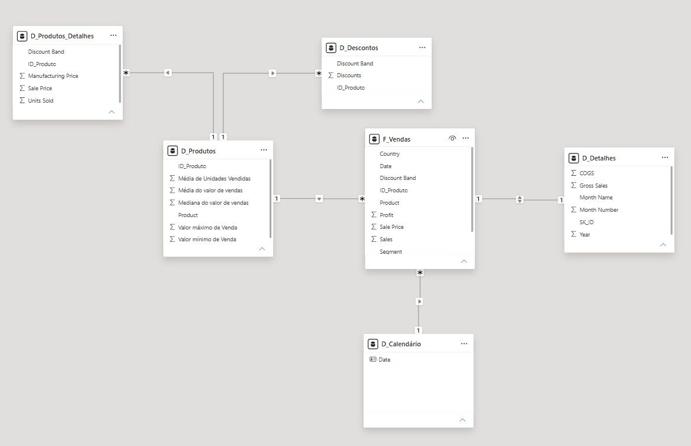

# Star Schema com Financial Sample (Power BI)

Desafio de projeto do curso de Power BI da DIO. A proposta: pegar uma tabela única de vendas (o Financial Sample) e quebrar em um modelo dimensional, com uma tabela fato e tabelas dimensão, tudo montado no Power Query e no DAX.

Aqui eu explico o que fiz, por que fiz e onde o modelo não ficou tão "de livro" quanto parece.



## O que tem nesta pasta

O arquivo `Desafio 5_star-schema-financial-sample.pbix` é o projeto completo. A imagem `esquema-estrela.jpg` é o diagrama da aba Modelo. Este README conta o processo.

## O modelo

A base original tem 700 linhas e 16 colunas, sem nenhum identificador de venda ou de produto. O modelo final tem 6 tabelas no Power BI, mais a origem escondida.

| Tabela | Papel | Conteúdo |
|---|---|---|
| `financials_origem` | Backup, carga desabilitada | A tabela original, com as chaves criadas |
| `F_Vendas` | Fato | `SK_ID`, `ID_Produto`, `Product`, `Units Sold`, `Sale Price`, `Discount Band`, `Segment`, `Country`, `Sales`, `Profit`, `Date` |
| `D_Produtos` | Dimensão | Um produto por linha, com média de unidades vendidas e média, mediana, máximo e mínimo do preço |
| `D_Produtos_Detalhes` | Dimensão | `ID_Produto`, `Discount Band`, `Sale Price`, `Units Sold`, `Manufacturing Price` |
| `D_Descontos` | Dimensão | `ID_Produto`, `Discounts`, `Discount Band` |
| `D_Detalhes` | Dimensão | `SK_ID`, `Gross Sales`, `COGS`, `Month Number`, `Month Name`, `Year` |
| `D_Calendário` | Dimensão de tempo | Criada em DAX |

## Passo a passo

1. Importação e backup: Importei o Financial Sample e abri em Transformar Dados. Renomeei a consulta para `financials_origem` e desabilitei a carga. Ela continua viva dentro do Power Query para alimentar as outras tabelas, mas não entra no modelo. É o "modo oculto" do enunciado.
2. Chaves: A tabela original não tem como identificar uma venda sozinha, porque combinações de data, produto e país se repetem. Criei duas chaves dentro da própria origem. A primeira é o `SK_ID`, uma coluna de índice começando em 0, que dá um número único para cada uma das 700 vendas. A segunda é o `ID_Produto`, uma coluna condicional que transforma o nome do produto em número (Carretera 0, Montana 1, Paseo 2, Velo 3, VTT 4, Amarilla 5). Mudei o tipo dela para número inteiro e conferi se não ficou nenhum valor vazio. Terminei com 18 colunas e as mesmas 700 linhas.
3. Tabelas derivadas por referência: Criei cada tabela com a opção Referência, não Duplicar. Assim todas continuam ligadas à origem, e uma correção feita lá vale para todas. As quatro tabelas `F_Vendas`, `D_Descontos`, `D_Produtos_Detalhes` e `D_Detalhes` saíram de Escolher Colunas, e depois reorganizei as colunas na ordem do enunciado.
4. D_Produtos por agrupamento: Usei Agrupar por, em modo avançado, agrupando por `Product` e `ID_Produto` juntos. Se agrupasse só por produto, o `ID_Produto` sumiria e a tabela não teria como se ligar à fato. O resultado são 6 linhas, uma por produto, com média de `Units Sold` e média, mediana, máximo e mínimo de `Sale Price`.
5. Calendário em DAX: Depois do Fechar e Aplicar, criei a `D_Calendário` com esta fórmula, que gera todos os dias de 1º de janeiro do primeiro ano a 31 de dezembro do último ano da fato:
```
D_Calendário = CALENDAR(DATE(YEAR(MIN(F_Vendas[Date])), 1, 1), DATE(YEAR(MAX(F_Vendas[Date])), 12, 31))
```
Marquei a tabela como tabela de data. A função `CALENDAR` gera a coluna como data e hora, e a da fato era só data, então ajustei o tipo para Data nas duas, para a chave não ficar com tipos diferentes.

6. Relações: Todas de um para muitos, com filtro em um sentido, exceto uma. `D_Produtos` filtra `F_Vendas`, `D_Descontos` e `D_Produtos_Detalhes` pelo `ID_Produto`. `D_Calendário` filtra `F_Vendas` pela `Date`. `F_Vendas` e `D_Detalhes` se ligam pelo `SK_ID` em relação um para um, porque os 700 IDs são únicos nas duas.

## Ferramentas e funções usadas

No Power Query: Obter Dados do Excel, Referência, Escolher Colunas, Coluna de Índice, Coluna Condicional, Agrupar por (`Table.Group` com `List.Average`, `List.Median`, `List.Max` e `List.Min`), Alterar Tipo, Renomear e Reordenar Colunas, e Habilitar Carga.

No DAX: `CALENDAR`, `DATE`, `YEAR`, `MIN` e `MAX`.

No modelo: relações de um para muitos e um para um, direção do filtro, e marcação de tabela de data.

## Decisões e limitações

- É uma estrela com um braço, não uma estrela pura. `F_Vendas` liga em três dimensões, mas `D_Produtos` também liga em `D_Descontos` e `D_Produtos_Detalhes`. Isso acontece porque o enunciado manda essas duas tabelas usarem `ID_Produto` como chave, e essa coluna se repete nelas, então elas não podem ser o lado "um" de uma relação. A consequência é que o filtro anda de um para muitos: filtrar pela `D_Produtos` funciona, mas filtrar pela `D_Descontos` não chega até a `F_Vendas`. Uma melhoria seria dar a essas tabelas uma chave única, por exemplo uma tabela só com as faixas de desconto ligada direto à fato.

- Mediana, máximo e mínimo do preço são iguais em todos os produtos. Na `D_Produtos` esses três valores saíram idênticos (20, 350 e 7). Pelas linhas que analisei, o preço parece variar por segmento e não por produto. Não validei essa regra nas 700 linhas, então trato como observação. As médias, essas sim, mudam de produto para produto.

- Interpretações do enunciado. O enunciado cita "Salers", e como a base não tem coluna de vendedor, entendi que é `Sales`. Ele pede média de unidades vendidas no texto, mas a imagem de exemplo usa uma soma com o nome "Contagem". Segui o texto e usei a média.

- A coluna `ID_Produto` é fixa para 6 produtos. A coluna condicional lista os produtos um a um. Se aparecer um sétimo produto na base, ele vira vazio até alguém incluir a regra. Para este exercício serve, mas não escalaria.

## Como abrir

Baixe o `.pbix` e abra no Power BI Desktop. Para ver o modelo, vá na aba Modelo. Para ver as transformações, vá em Transformar Dados e confira as Etapas Aplicadas de cada tabela.

Se você curtiu ou tem uma ideia de como melhorar o modelo, me chama pra trocar uma ideia. 🙂

