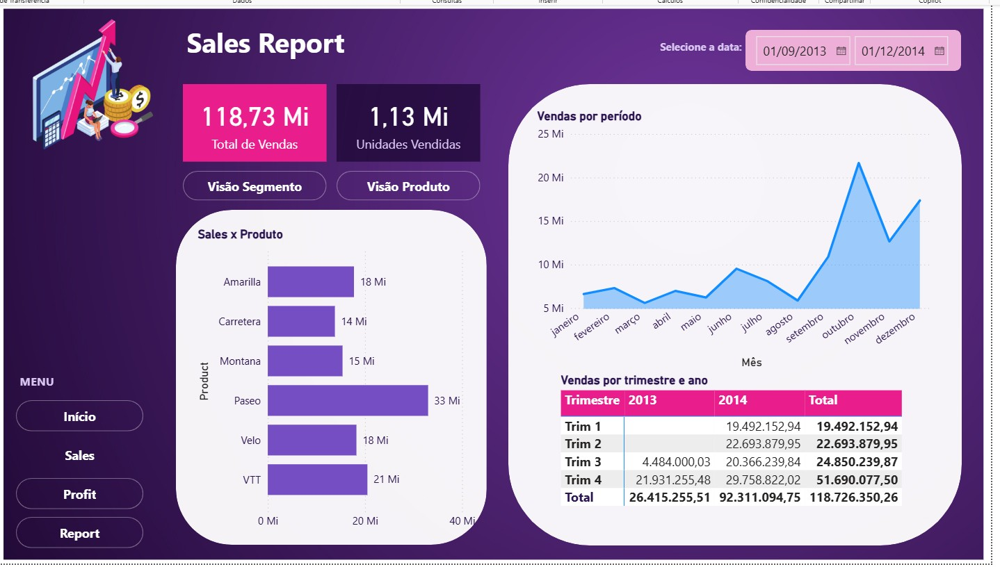
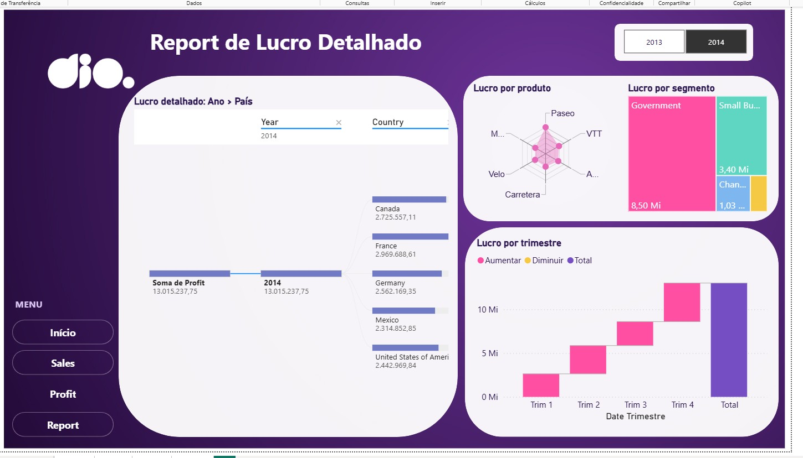
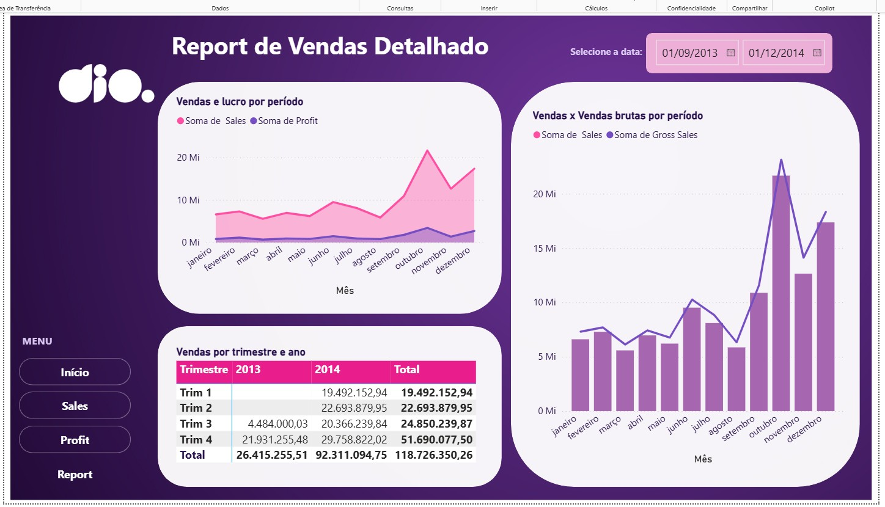

# Desafio de Projeto: Atualizando Relatório Financeiro com Foco na Experiência do Usuário

Este é o meu desafio 6 da **Formação Power BI Analyst (DIO)**. A proposta foi pegar o relatório criativo que construímos no curso e refazê-lo pensando em quem vai usar: onde cada coisa fica, o que se lê primeiro, como a pessoa navega de uma página pra outra.

O arquivo do projeto é o `Desafio6_desafio-report-financeiro-ux.pbix`. Pra abrir, é só ter o Power BI Desktop instalado.

## O que eu construí

O relatório é composto por quatro páginas, Home, Sales, Profit e Report. A base de dados é a tabela `financials`, a mesma do curso, com vendas, lucro, unidades, segmento, produto e país entre 2013 e 2014.

A *Sales* é a visão geral. Tem os cartões de Total de Vendas e Unidades Vendidas, um filtro de data, o gráfico de área de vendas por período e uma matriz por trimestre e ano. Também tem dois botões, Visão Segmento e Visão Produto, que trocam o gráfico de barras usando indicadores. Assim, um único espaço mostra duas leituras sem poluir a tela.

A *Profit* é o lucro em detalhe. Nela tem a árvore de decomposição (Ano e depois País), o radar de lucro por produto, o treemap por segmento e a cascata de lucro por trimestre. O filtro de ano ficou em botões lado a lado, pra alternar entre 2013 e 2014 num clique.

Já a *Report* mostra vendas e lucro ao longo do tempo, a matriz de trimestre por ano e o combo de Vendas contra Vendas Brutas por mês.

## Como pensei na experiência do usuário

Segui os quatro pontos que o desafio pediu, sem tratar nenhum como regra rígida.

- Posicionamento: O olhar começa pelo título, passa pelos números principais e só depois chega nos gráficos de detalhe. O menu fica sempre no mesmo lugar, à esquerda, em todas as páginas.
- Contraste: Fundo roxo escuro com painéis claros e texto escuro dentro deles, que é onde o conteúdo realmente precisa ser lido. O rosa fica reservado pra destaque, como o cartão principal e a página atual.
- Proporção áurea: Usei como aproximação, não como régua. As páginas de dados dividem a área em uma coluna larga e uma estreita, numa proporção próxima de 1,6 pra 1.
- Segmentação: Cada grupo de visuais mora no seu próprio painel arredondado, então dá pra entender de relance o que está junto com o quê.

## Navegação

Todas as páginas têm o mesmo menu (Início, Sales, Profit e Report). A página em que você está fica "apagado". Pra testar no Desktop, use Ctrl + clique. No modo leitura o clique normal já funciona.

## Prints

## O que aprendi

O que mais me marcou foi perceber como pequenas decisões de layout mudam a leitura de um relatório com os mesmos dados. Mover um filtro de lugar, agrupar dois gráficos num painel, destacar a página atual no menu... nada disso muda o número, mas muda a facilidade de chegar nele.
